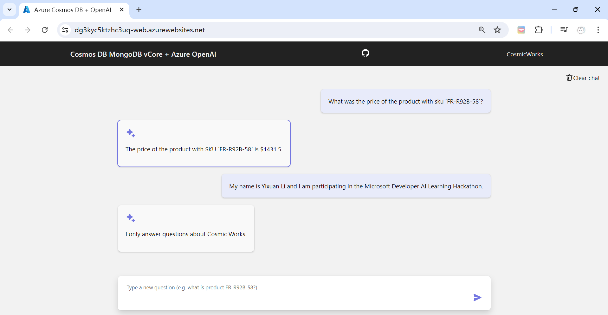

# Shop-Assistant-ChatBot

This project creates an intelligent chatbot designed to respond to customer queries about products. It leverages specific data from the [Azure-OpenAI-Python-Developer-Guide](https://github.com/AzureCosmosDB/Azure-OpenAI-Python-Developer-Guide). The chatbot uses vCore-based Azure Cosmos DB for MongoDB vector search and document retrieval, combined with Azure OpenAI services and finally depolyed to Azure. This project is part of the Microsoft Developers AI Learning Hackathon.

## Built with

Python, MongoDB, Bicep, Azure OpenAI, Azure Cosmos DB, Azure CLI, Azure Powershell, Langchain, Fast API, Docker

## Example

